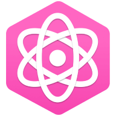

  

  <h1 align='center' >
    Wongames
  </h1>
 

<h4 align="center">
  A games store website built with React, Next.js, Typescript and <i>more<i>!
</h4>

  

## This project is still under development so I haven't created a detailed README
  
### If you want, you can check the Storybook of the project, in there you can see all the components created for the application.
### [Click here to see the Storybook](https://wongames-storybook-tiagodiass.netlify.app/)
